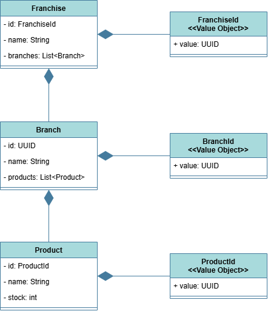
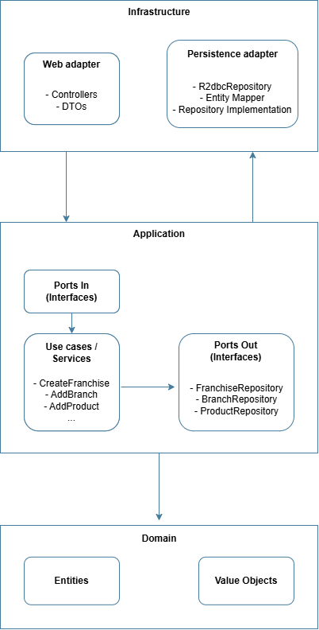
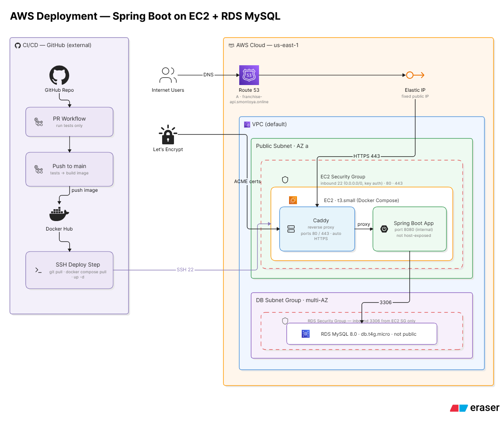

# Franchise API

Project: a small reactive REST API to manage franchises, their branches and products. The service exposes endpoints to create and query franchises, add/rename branches, add/rename/remove products and update product stock. It also provides a "top stock product per branch" query for a franchise.

This README is generated from the repository sources (Gradle build, controllers, Terraform, Docker/Caddy files and docs). It contains accurate, runnable instructions for running the API locally and an endpoint reference.

---

## 1. Project overview

- Core domain: Franchise -> Branch -> Product. A Franchise owns zero or more Branches; a Branch owns zero or more Products.
- Primary capabilities implemented by the API:
  - Create and read a Franchise (including its branches and products)
  - Add Branch to an existing Franchise
  - Rename Franchise / Branch / Product
  - Add Product to a Branch with initial stock
  - Update Product stock
  - Remove Product
  - Query the top-stock product per branch for a Franchise
- Business rules (enforced in DB schema and by DTO validation):
  - Names are required and must be between 3 and 150 characters.
  - Branch names are unique per franchise; product names are unique per branch.
  - IDs are UUIDs (stored as char(36) in the DB schema).
  - Product stock is an integer and must be >= 0.

All REST controllers expose routes under the global base path `/api/v1` (configured in `application.yml`).

---

## 2. Tech stack

- Java 21 (Gradle toolchain) — modern LTS Java version used for new language features and compatibility with Spring Boot 4.
- Spring Boot 4.0.7 (WebFlux) — reactive REST stack; chosen to provide a non-blocking/reactive server.
- Spring WebFlux — reactive web layer used by controllers.
- Spring Data R2DBC + r2dbc-mysql — reactive database driver (R2DBC) and MySQL runtime driver; selected to keep the stack fully reactive (instead of blocking JDBC/JPA).
- Spring Boot Actuator — runtime health endpoint used by Docker `HEALTHCHECK`.
- Springdoc OpenAPI (webflux) — API docs (swagger-ui enabled in dev profile).
- Lombok (compileOnly) — boilerplate reduction for DTOs and other small helpers.
- Testcontainers (JUnit) — integration tests run against ephemeral databases inside Docker.
- MySQL (8.0) — relational store; schema is applied via docker-compose init script.
- Docker & Docker Compose — containerized development and production deployment artifacts.
- Caddy — reverse proxy & automatic HTTPS (used in production compose with the provided `Caddyfile`).
- Terraform — IaC for AWS resources (EC2, RDS, Route53, EIP, security groups, subnet groups).
- AWS resources actually provisioned by the Terraform code in `iac/`: EC2 instance, Elastic IP, RDS (MySQL), Route53 hosted zone and A record, security groups, DB subnet group.
- GitHub Actions — CI/CD pipeline builds, tests, pushes Docker images to Docker Hub and deploys to the EC2 host via SSH.
- Docker Hub — container image registry (the workflow pushes `smontoya97/franchise-api:latest`).

Each nontrivial choice is included to support a fully reactive pipeline (R2DBC + WebFlux) and an easy-to-deploy containerized production composition driven from a single EC2 instance + Caddy reverse proxy.

---

## 3. Diagrams

The `docs/diagrams/` folder contains visuals used to explain the system. Embedded here with captions:


*Class diagram showing the main domain model (Franchise, Branch, Product) and key relationships.*


*High-level hexagonal / clean architecture diagram showing inbound adapters (web), application/use-cases, domain and outbound adapters (persistence).* 


*Simplified AWS deployment diagram: single EC2 running Docker Compose (app + Caddy), an RDS MySQL instance in private subnets, Route53 record pointing to an Elastic IP.*

---

## 4. Deployment architecture (what the Terraform code provisions)

The `iac/` Terraform configuration provisions the following resources:

- VPC/subnets (data lookups against the default VPC in the selected region).
- An EC2 instance (`aws_instance.franchise_api`) which runs the production `docker-compose.prod.yml` stack.
- An Elastic IP (`aws_eip.franchise_api_eip`) attached to the EC2 instance so the instance keeps a stable public IP.
- A Route53 hosted zone and an A record (`${subdomain}.${domain_name}`) pointing to the Elastic IP.
- An RDS MySQL instance (`aws_db_instance.franchise_db`) running MySQL 8.0 in private subnets (not publicly accessible). A DB subnet group is created as well.
- Security groups:
  - `ec2_sg`: allows SSH (port 22), HTTP (80) and HTTPS (443) to the EC2 host.
  - `rds_sg`: allows MySQL (3306) only from the EC2 security group.

Notes on CI/CD (GitHub Actions):
- The workflow at `.github/workflows/ci-cd.yml` runs tests on PR and on pushes to `main`. On a push to `main`, after tests pass the pipeline builds and pushes Docker images to Docker Hub (`smontoya97/franchise-api:latest` and `:sha`) and then SSHs into the EC2 host (using SSH secrets) to pull and restart the production Docker Compose stack.

---

## 5. How it works (request flow / hexagonal architecture)

The project follows a clean/hexagonal layout:

1. HTTP request arrives at a WebFlux controller (controllers under `infrastructure/adapter/in/web/controller`). Controllers are thin: they validate the request DTOs and delegate to application use-cases.
2. Application layer (ports and use-cases) implements business logic orchestrating domain models and outbound adapters.
3. Domain models (in `domain/model`) contain the core entities/value objects and domain exceptions.
4. Infrastructure adapters (persistence) implement ports to read/write data using R2DBC and map domain objects to persistence models.
5. Responses are mapped back to response DTOs and returned as reactive types (Mono/Flux) to the client.

This separation keeps controllers lightweight and focused on transport concerns and keeps business logic testable in the application/domain layers.

---

## 6. Accessing the production deployment

The project includes a `Caddyfile` that defines the public domain used in production:

```
franchise-api.smontoya.online {
    reverse_proxy app:8080
}
```

When the Terraform DNS records are applied and the EC2 instance is running the production compose stack, the public base URL is:

```
https://franchise-api.smontoya.online/api/v1
```

Quick curl examples (replace environment values if needed):

- Create a franchise
```bash
curl -sS -X POST "https://franchise-api.smontoya.online/api/v1/franchises" \
  -H "Content-Type: application/json" \
  -d '{"name": "Acme Franchise"}'
```

- Get franchise (replace <franchiseId>)
```bash
curl -sS "https://franchise-api.smontoya.online/api/v1/franchises/<franchiseId>"
```

If the production deployment is not reachable you can run locally (see next section).

---

## 7. Running locally — prerequisites

- Docker (tested with Docker Engine >= 20.10) and Docker Compose (v2 `docker compose` is used in CI). Docker Desktop or Docker Engine is required for Testcontainers-based tests.
- (Optional) Java 21 if you want to build the JAR locally without Docker. The Gradle toolchain is configured to Java 21 in `build.gradle`.

---

## 8. Running locally — instructions

The repository includes a `docker-compose.yml` for local development. It starts a MySQL container (initialized with the SQL schema) and the application container built from the project.

1. Start the stack:

```bash
# from repository root
docker compose up --build -d
```

2. Wait for the MySQL container to finish initialization (it runs `src/main/resources/db/schema.sql` automatically), then verify the application health endpoint:

```bash
curl -sS http://localhost:8080/api/v1/actuator/health | jq
# expected output: { "status": "UP" } or similar
```

3. API docs (dev profile) are available at:

```
http://localhost:8080/api/v1/webjars/swagger-ui/index.html
```

Environment variables used in production are shown in `.env.prod.example` (copy to `.env.prod` for production compose). For local compose the DB credentials and R2DBC URL are set inside `docker-compose.yml`.

Alternative: build and run locally without Docker

```bash
./gradlew bootJar
java -jar build/libs/app.jar
```

---

## 9. API endpoints

All endpoints are prefixed with the global base path `/api/v1` (see `application.yml`). Path variables use UUIDs.

Resources: Franchises, Branches, Products

Franchises

- POST /api/v1/franchises
  - Create a franchise.
  - Request body: { "name": "<string, 3-150 chars>" }
  - Response: Franchise (201)

- GET /api/v1/franchises/{franchiseId}
  - Get franchise details including branches and products (200)

- GET /api/v1/franchises/{franchiseId}/top-stock-products
  - Returns a list of top-stock products per branch for the franchise (200)
  - Response elements: { "branch_id", "branch_name", "product_id", "product_name", "stock" }

- PATCH /api/v1/franchises/{franchiseId}/name
  - Rename a franchise. Body: { "name": "new name" } (200)

Branches

- POST /api/v1/franchises/{franchiseId}/branches
  - Add branch to a franchise. Body: { "name": "Branch Name" } (201)

- PATCH /api/v1/franchises/{franchiseId}/branches/{branchId}/name
  - Rename branch. Body: { "name": "New Branch Name" } (200)

Products

- POST /api/v1/branches/{branchId}/products
  - Add product to a branch. Body: { "name": "Product", "initial_stock": <int >= 0> } (201)

- PATCH /api/v1/branches/{branchId}/products/{productId}/stock
  - Update product stock. Body: { "new_stock": <int >= 0> } (200)

- PATCH /api/v1/branches/{branchId}/products/{productId}/name
  - Rename product. Body: { "name": "New Product Name" } (200)

- DELETE /api/v1/branches/{branchId}/products/{productId}
  - Remove product (204)

Postman collection

The repository contains a Postman collection and two environment files in `docs/postman/`:

- `docs/postman/franchise-api.postman_collection.json` — collection (v2.1.0)
- `docs/postman/local.postman_environment.json` — environment for local (base_url = http://localhost:8080/api/v1)
- `docs/postman/production.postman_environment.json` — environment for production (base_url = https://franchise-api.smontoya.online/api/v1)

Import the collection and the corresponding environment into Postman. Select the environment, and you can run requests in sequence (Create Franchise -> Add Branch -> Add Product, etc.).

---

## 10. Testing

Unit and integration tests are run with Gradle:

```bash
./gradlew test
```

Integration tests use Testcontainers and therefore require Docker running locally.

---

## 11. Project structure

High-level layout (relevant folders):

```
src/main/java/com/accenture/franchiseapi/
  ├─ application/      # use-cases, commands, services
  │    ├─ command/
  │    ├─ port/in/
  │    └─ service/
  ├─ domain/           # domain model and exceptions
  └─ infrastructure/   # adapters and configuration
      └─ adapter/
          └─ in/
              └─ web/ # controllers, DTOs, mappers
```

Key controller classes live under:
`infrastructure/adapter/in/web/controller` — FranchiseController, BranchController, ProductController.

---

## 12. Environment variables & Terraform inputs

- For local development (docker-compose): see `docker-compose.yml` — DB credentials are defined there by default.
- Production env example (copy `.env.prod.example` -> `.env.prod`):

```
DB_HOST=your-rds-endpoint.rds.amazonaws.com
DB_USER=franchise_app
DB_PASSWORD=change-me
```

- Terraform variables (see `iac/variables.tf`): `aws_region`, `admin_ip_cidr`, `db_name`, `db_username`, `db_password`, `key_pair_name`, `instance_type`, `db_instance_class`, `domain_name`, `subdomain`.

---

## Troubleshooting

- If the Postman collection shows an empty URL field after import: import both the collection and the environment, then explicitly select the environment in Postman so `{{base_url}}` resolves.
- If the app health endpoint is failing locally: ensure the MySQL container finished initialization (check `docker logs mysql`) and that `docker compose up` completed the DB init scripts.
- If tests using Testcontainers fail locally, confirm Docker is running and the engine has sufficient resources.

---

## Contributing

Pull requests welcome. The CI pipeline runs unit and integration tests and will build and push images only from `main`.

---

If you want, I can also add a dedicated `docs/USAGE.md` with runnable curl scenarios and a short developer guide for common tasks (running single tests, adding a new endpoint, etc.).

